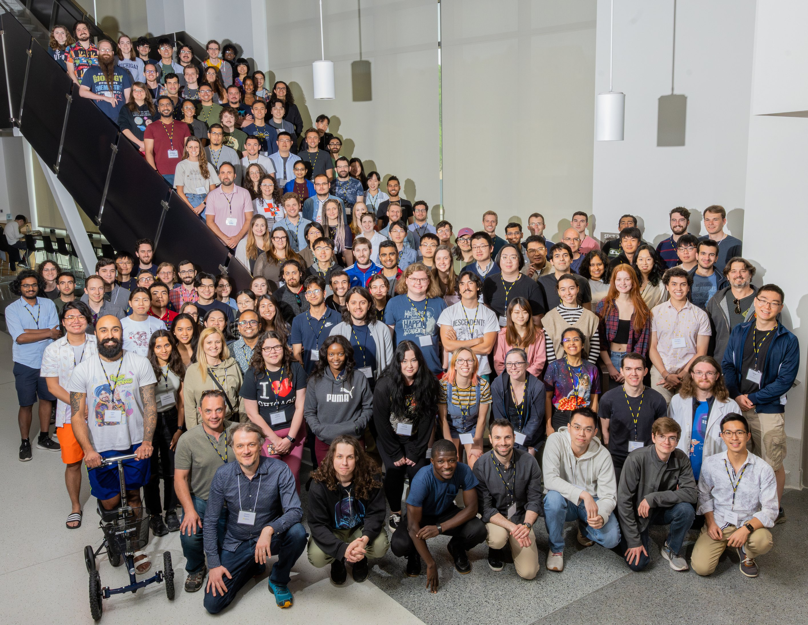

The 2nd Michigan Cosmology Summer School will cover areas of cosmology, focusing specifically on the interface of data and theory. The format will be hybrid, with ~120 participants expected to attend in person but open to online participation as well. Outdoor activities will be organized. For more information, click on the bars on the top right of this page.

The School will be livestreamed on Youtube; the link is [HERE](https://www.youtube.com/@cosmomichigan/streams).

|Lecturer           |Institution                                |Topic
|-----------------------|-------------------------------------------|------------------------------------
|Gary Bernstein         |University of Pennsylvania                 |Measuring and Mapping Cosmic Shear
|Frank van den Bosch    |Yale University                            |Galaxy-Halo Connection
|Elisa Ferreira         |Kavli IPMU                                 |Dark Matter Models
|Lehman Garrison        |Flatiron Institute                         |Let's Write an HOD Code!
|Vera Gluscevic         |University of Southern California          |Cosmological Probes of Dark Matter
|Gil Holder             |University of Illinois Urbana-Champaign    |CMB Analysis and connections to LSS
|Emille Ishida          |CNRS, Clermont Ferrand                     |Machine Learning
|Joel Meyers            |Southern Methodist University              |CMB vs. Fundamental Physics
|Levon Pogosian         |Simon Fraser University                    |Dark Energy and Modified Gravity

Local Organizing Committee: Dragan Huterer (chair), Felipe Andrade-Oliveira, Uendert Andrade, Camille Avestruz, Gus Evrard, Johannes Lange, Minh Nguyen, Kuan Wang

